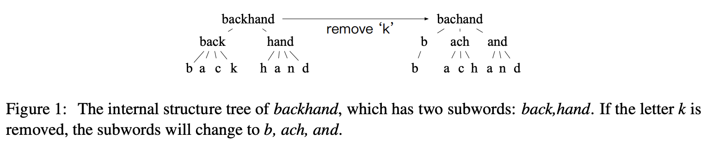
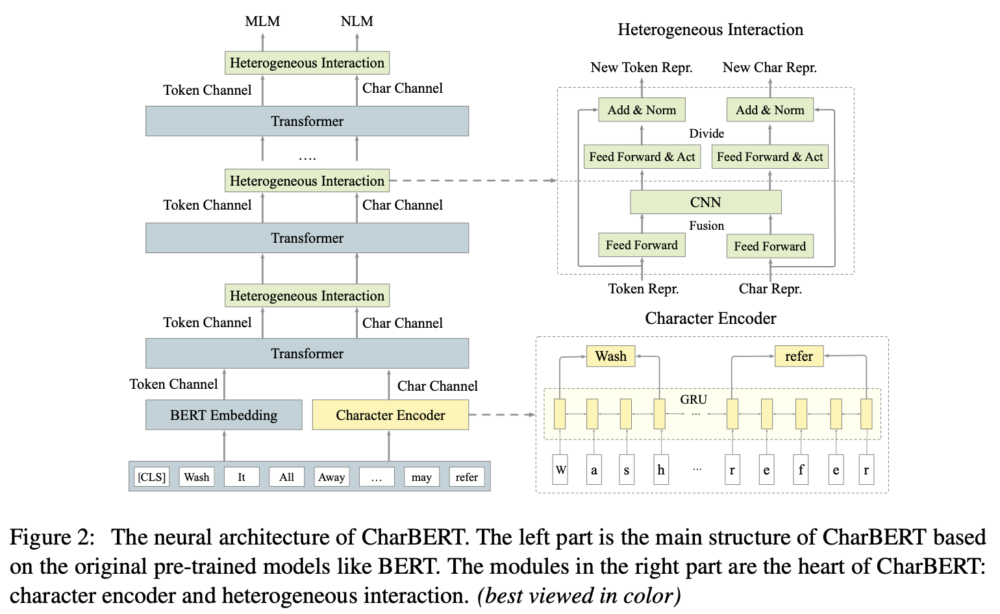
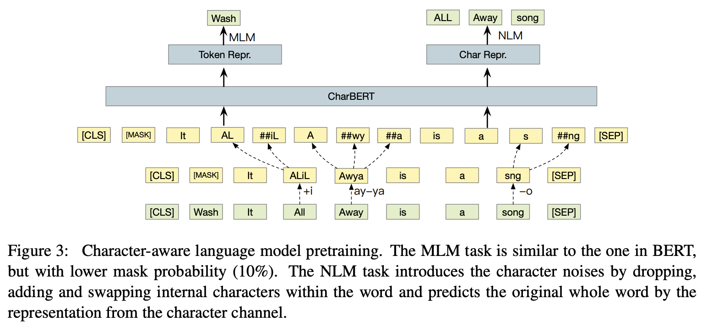
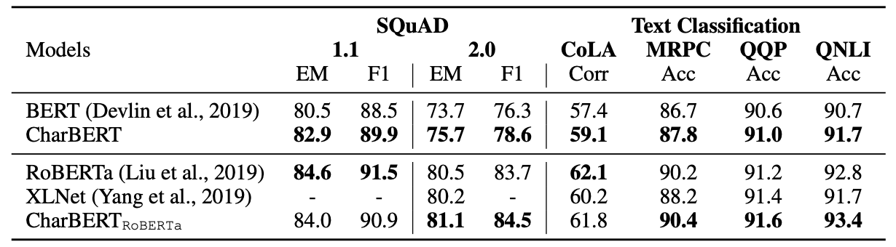
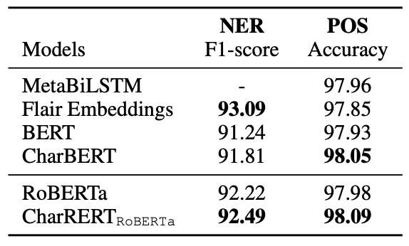
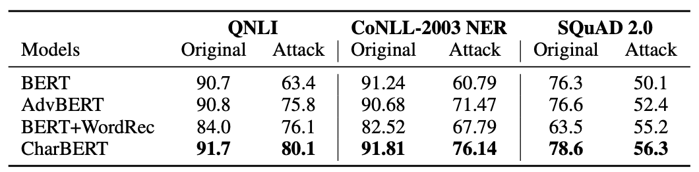

## CharBERT: Character-aware Pre-trained Language Model

Wentao Ma et al. (iFLYTEK Research)

<br>

### References

- CharBERT: [COLING 2020](https://arxiv.org/abs/2011.01513)
- [repository](https://github.com/wtma/CharBERT)

<br>

### Summary

- 서브워드는 불완전하고 깨지기 쉬운 Representation을 학습
- 캐릭터와 서브워드를 함께 활용하는 방안을 제시할 것
- 캐릭터를 활용하는 훈련 기법이 철자 오류에 강건한 PLM을 학습할 수 있음을 결과로 증명

<br>

### Introduction

- 서브워드 기반의 토크나이저는 거의 모든 단어를 인코딩하여, OOV 문제에서 비교적 자유롭다는 장점
- 그러나 서브워드 기반 언어 모델은 아래와 같은 단점을 지니고 있음
	- **Incomplete Modeling** : 캐릭터와 같은 _fine-grained_ 자질의 정보가 부족
	- **Fragile Representation** : 작은 오탈자 하나가 서브워드 분절을 망칠 수 있음



- 위 예를 보면 `backhand` 라는 단어가 오탈자 하나로 인해 `bachand` 로 입력될 경우, 서브워드 분절이 완전히 다르게 수행될 수 있음 : `['back', 'hand']` -> `['b', 'ach', 'and']`
- 이에 반해 캐릭터 모델은 단순히 `k` 자질을 하나 잃은 것에 그치게 됨
- 따라서 다양한 사용자의 입력이 들어올 수 있는 **Wild**한 컨디션을 고려하면, 단지 서브워드에만 의존하는 모델은 한계를 지닐 수 밖에 없게 됨
- 그렇다면 서브워드 기반의 PLM에 캐릭터 자질을 어떻게 **잘** 녹여낼 수 있을까?

<br>

### Methodology



- 위 그림과 같이 서브워드와 캐릭터를 입력으로 받는 _dual-channel_ 아키텍처 활용
- **캐릭터 단위 인코딩**은 다음 과정을 거치게 됨 :
  - 캐릭터 임베딩 via. `nn.Embedding`
  - 캐릭터 시퀀스를 `Bi-GRU`에 태워 캐릭터별 _hidden representation_ 추출
  - 서브워드의 경계가 되는 **시작 캐릭터**와 **종결 캐릭터**를 뽑아 _concat_
  - _concat_ 된 _representation_ 이 서브워드를 보충하는 자질로 활용

```python
class CharBertEmbeddings(nn.Module):

    def __init__(self, config):
        super(CharBertEmbeddings, self).__init__()
        self.config = config
        self.char_emb_config = bert_charemb_configroberta_charemb_config
        self.char_embeddings = nn.Embedding(
          self.char_emb_config["char_vocab_size"],
          self.char_emb_config["char_embedding_size"],
          padding_idx=0,
        )
        self.rnn_layer = nn.GRU(
          input_size= self.char_emb_config["char_embedding_size"],
          hidden_size=int(config.hidden_size/4),
          batch_first=True,
          bidirectional=True,
        )

    def forward(self,
                char_input_ids,
                start_ids,
                end_ids):
        input_shape = char_input_ids.size()

        assert len(input_shape) == 2
        
        batch_size, char_maxlen = input_shape[0], input_shape[1]

        char_input_ids_reshape = torch.reshape(char_input_ids, (batch_size, char_maxlen))
        char_embeddings = self.char_embeddings(char_input_ids_reshape)
        self.rnn_layer.flatten_parameters()
        all_hiddens, last_hidden = self.rnn_layer(char_embeddings)
        
        # 토큰 시작부와 종결부는 인덱스로 기록해두었다가 Matmul로 뽑아옴 : 경계 추출
        start_one_hot = nn.functional.one_hot(start_ids, num_classes=char_maxlen)
        end_one_hot   = nn.functional.one_hot(end_ids, num_classes=char_maxlen)

        start_hidden  = torch.matmul(start_one_hot.float(), all_hiddens)
				end_hidden    = torch.matmul(end_one_hot.float(), all_hiddens)

        # 시작부와 종결부를 Concat 하여 토큰 임베딩으로 사용
        char_embeddings_repr = torch.cat([start_hidden, end_hidden], dim=-1)
        return char_embeddings_repr
      
'''
# cf. What is `nn.functional.one_hot`?

>>> F.one_hot(torch.arange(0, 5) % 3, num_classes=5)
tensor([[1, 0, 0, 0, 0],
        [0, 1, 0, 0, 0],
        [0, 0, 1, 0, 0],
        [1, 0, 0, 0, 0],
        [0, 1, 0, 0, 0]])
'''
```

- 앞선 얻게 된 **캐릭터** _to_ **서브워드** 단위 자질은 아래 로직을 통해 기존 서브워드 _representation_ 와 함께 활용
  - 동일한 Transformer 레이어를 타고 나온 _token repr._ 과 _char repr._ 은 서로 다른 `Linear` 를 한 번 통과
  - 각자의 `Linear` 를 타고 나온 _repr._ 들은 _concat_ 되어 `Conv1D` 를 통과
  - `Conv1D` 의 결과가 또 다시 서로 다른 `Linear` 를 통과
  - 두 번째 `Linear` 의 개별 결과가 _token repr._ 과 _char repr._ 에 Residual 하게 더해진 후, `LayerNorm`

```python
class CharBertEncoder(nn.Module):
    
    def __init__(self, config, is_roberta=False):
        super(CharBertEncoder, self).__init__()
        self.output_attentions = config.output_attentions
        self.output_hidden_states = config.output_hidden_states
        self.layer = nn.ModuleList([BertLayer(config) for _ in range(config.num_hidden_layers)])

        self.word_linear1 = nn.Linear(config.hidden_size, config.hidden_size, bias=False)
        #self.word_linear2 = nn.Linear(config.hidden_size, config.hidden_size, bias=True)
        self.char_linear1 = nn.Linear(config.hidden_size, config.hidden_size, bias=False)
        #self.char_linear2 = nn.Linear(config.hidden_size, config.hidden_size, bias=True)
        
        self.fusion_layer = torch.nn.Conv1d(
          in_channels=config.hidden_size * 2,
          out_channels=config.hidden_size,
          kernel_size=3,
          padding=3//2,
        )
            
        self.act_layer = ACT2FN[config.hidden_act]
        self.word_norm = BertLayerNorm(config.hidden_size, eps=config.layer_norm_eps)
        self.char_norm = BertLayerNorm(config.hidden_size, eps=config.layer_norm_eps)
        self.is_roberta = is_roberta

    def forward(self,
                char_hidden_states,
                hidden_states,
                attention_mask=None,
                head_mask=None,
                encoder_hidden_states=None,
                encoder_attention_mask=None):
        all_hidden_states = ()
        all_attentions = ()

        for i, layer_module in enumerate(self.layer):
            fusion_layer = self.fusion_layer

            if self.output_hidden_states:
                all_hidden_states = all_hidden_states + (hidden_states,)

            layer_outputs = layer_module(hidden_states, 
                                         attention_mask, 
                                         head_mask[i], 
                                         encoder_hidden_states, 
                                         encoder_attention_mask)
            char_layer_outputs = layer_module(char_hidden_states, 
                                              attention_mask, 
                                              head_mask[i], 
                                              encoder_hidden_states, 
                                              encoder_attention_mask)

            word_outputs   = layer_outputs[0]
            char_outputs   = char_layer_outputs[0]

            word_transform = self.word_linear1(word_outputs)
            char_transform = self.char_linear1(char_outputs)
            share_cat      = torch.cat([word_transform, char_transform], dim=-1)

            share_permute  = share_cat.permute(0, 2, 1)
            share_fusion   = fusion_layer(share_permute)
            share_hidden   = share_fusion.permute(0, 2, 1)
            
            #word_states    = self.act_layer(self.word_linear2(share_hidden))
            #char_states    = self.act_layer(self.char_linear2(share_hidden))
            hidden_states  = self.word_norm(share_hidden + word_outputs)
            char_hidden_states = self.char_norm(share_hidden + char_outputs)
						...
```

- ~~하지만 코드를 보면 두 번째 `Linear` 는 태우지 않고, `Conv1D` 의 결과 값에 Residual Connection을 해주더라...~~
- 사전 학습으로는 일반적인 BERT-style MLM 외에 **NLM** (Noisy Language Modeling) 태스크 추가 사용



- **NLM** 은 문장을 구성하는 어절 중 일부 어절에 임의의 캐릭터를 **추가**하거나, **삭제**하거나, 인접한 **캐릭터의 위치를 변경**하는 등의 노이즈를 부여하는 방식으로 진행
- **노이즈 공격**을 받은 어절은 기존과 다른 방식으로 서브워드가 분절될 것
- 기존과 다르게 분절된 서브워드를 나타내는 _char repr._ 은 캐릭터로 구성한 _repr._ 만 가지고 원래의 **어절**이 무엇이었는지를 맞추어야 함 : 이를 위해 `30,000` 개의 어절 사전이 사전 학습 시 사용 (...)

```python
class BertLMPredictionHead(nn.Module):
    def __init__(self, config):
        super(BertLMPredictionHead, self).__init__()
        self.transform = BertPredictionHeadTransform(config)
        self.adv_transform = BertPredictionHeadTransform(config)

        self.decoder = nn.Linear(config.hidden_size,
                                 config.vocab_size,
                                 bias=False)

        self.adv_decoder = nn.Linear(config.hidden_size, term_vocab_size)
        self.bias = nn.Parameter(torch.zeros(config.vocab_size))

    def forward(self, hidden_states, char_hidden_states):
        hidden_states = self.transform(hidden_states)
        mlm_scores = self.decoder(hidden_states) + self.bias

        adv_hidden_states = self.adv_transform(char_hidden_states)
        term_scores = self.adv_decoder(adv_hidden_states)
        return mlm_scores, term_scores
```


- **노이즈 공격**을 받지 않은 서브워드에 한해서만 BERT-style MLM 적용 : _10% rate_

<br>

### Experiments

- **토큰 단위 예측**을 수행해야 하는 태스크 (e.g. 개체명 인식, 기계독해) 에 대해서는 서브워드 자질과 캐릭터 자질을 _concat_ 하여 Fine-tuning
- **문장 단위 예측**을 수행해야 하는 태스크 (e.g. 자연어 추론, 패러프레이즈 탐지) 에 대해서는 서브워드 자질과 캐릭터 자질을 _concat_ 한 후, _token represntation_ 들을 **평균**낸 벡터를 활용하여 Fine-tuning


- **SQuAD**를 포함한 대부분의 **문장 분류 태스크**에 있어 CharBERT는 성능 향상의 효과를 보임


- 특히 **토큰 단위 예측**에서는 기존 BERT, RoBERTa 보다 더 좋은 성능을 기록하는데 도움


- 이외에도 **NLM** 학습 데이터를 구축한 방식으로 _Downstream task_ 데이터셋에도 노이즈를 부여한 후, 강건하게 학습될 수 있는지를 실험
- 실험 결과 기존의 BERT 는 **노이즈 공격**을 받은 데이터셋으로 학습하게 되면, 성능이 대폭 하락하는 것을 확인할 수 있었음
- 그러나 이미 **NLM**을 통해 **노이즈**에 대한 내성이 생긴 CharBERT는 BERT를 비롯한 다른 베이스라인 모델들보다 성능 하락의 폭이 적었음

<br>

### Conclusion

- CharBERT 제안 기법의 장점
	- _character aware_ : 서브워드를 보충해 줄 수 있는 캐릭터 자질 학습 가능
	- _robustness_ : 오탈자 등에 강건한 PLM 의 학습 가능
	- _model-agnostic_ : BERT, RoBERTa 등 모든 Transformer 기반의 PLM 에 적용 가능
- 또한 기학습된 BERT, RoBERTa 등으로 _init_ 하여 학습하여도 충분하기 때문에 비교적 저렴한 투자
  - 학습 기간 : `V100` x 2 기준 5 일 소요
  - 학습 데이터양 : 영어 위키피디아 12G
  - 추가 파라미터 : `5M` 

