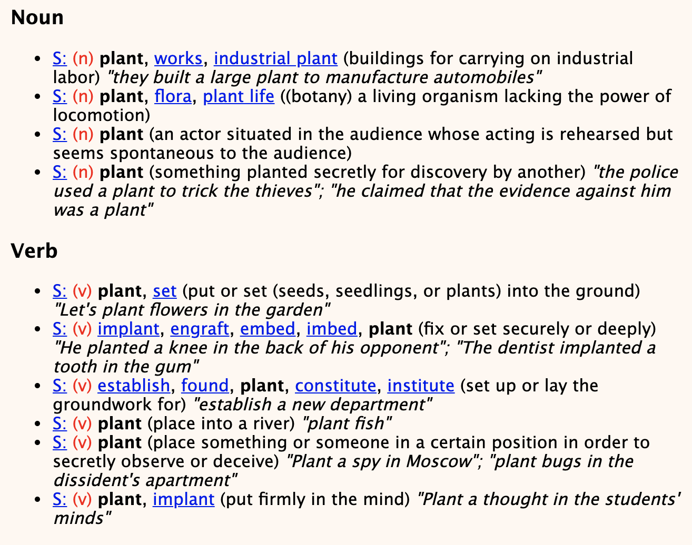

## Moving Down the Long Tail of Word Sense Disambiguation with Gloss-Informed Biencoders

Terra Blevins and Luke Zettlemoyer (University of Washington, FAIR)

<br>

### References

- Moving Down the Long Tail of Word Sense Disambiguation with Gloss-Informed Biencoders : [ACL 2020](https://arxiv.org/abs/2005.02590)
- [repository](https://github.com/facebookresearch/wsd-biencoders)

<br>

### Summary

- 단어의 중의성을 해소해주는 **Word Sense Disambiguation** (이하 WSD) 태스크에서 가장 큰 문제는 _word sense_ 가 _uniform_ 하게 등장하지 않아, _biased training_ 이 진행된다는 것
- 이를 해결하기 위해 단어의 사전적 정의를 **bi-encoder** 가 동일한 _representation space_ 에서 학습하도록 하여, 가장 가까운 _sense embedding_ 을 찾는 문제로 치환
- 훈련 과정에서 흔히 등장하지 않던 _word sense_ 도 잘 맞추며 성능의 개선이 있었음

<br>

### Introduction

- **WSD** 태스크에서 가장 골치 아픈 문제 중 하나는 Zipf's Law 를 따라 특정 _word sense_ 들의 훈련 데이터가 굉장히 부족하다는 것
- 실제로 **WSD** 데이터셋 중 가장 큰 규모의 학습 데이터인 **SemCor** 를 보면 단어 _plant_ 는 90%의 확률로 상위 두 개 뜻으로만 사용되었으며, 10개의 뜻 중 단 5개의 뜻만 사용되었음



- 이처럼 _data imbalance bias_ 가 강하게 존재하는 데이터셋으로 학습된 모델은, 컨텍스트에 상관 없이 _plant_ 의 의미를 1 번째 혹은 2 번째 뜻으로 예측을 하려고 하게 됨
- 그러나 좋은 모델은 자주 등장한 _word sense_ 뿐만 아니라, 훈련 시 자주 등장하지 않은 _sense_ 도 잘 맞추어주는 모델 !
- 본 논문에서는 입력 문장을 **Pre-trained BERT** 기반의 _context encoder_ 로 하여금, 단어의 사전적 의미들을 _gloss encoder_ 로 하여금 인코딩 해, 각 _embedding_ 이 가까워지도록 학습하여 성능 개선
- 해당 전략을 통해 **SOTA** 를 달성하였으며, 대부분의 성능 향상이 훈련 시 자주 등장하지 않았던 _word sense_ 에서 이루어지며 (F1 score 15.6 improved) 기대한 효과를 이루었음

<br>

### Methodology


- 논문에서 제안한 **Bi-Encoder Model** (이하 BEM) 은 위 그림과 같은 구조를 따름
- _Context Encoder_ 는 **다의어** 를 비롯하여 문장 전체를 인코딩
- _Gloss Encoder_ 는 **다의어** 들의 사전적 의미를 인코딩
- 이후, **다의어** 의 _reresentation_ 과, 인코딩된 사전적 의미 문장의 `[CLS]` 토큰의 _representation_ 을 가깝고 멀리 위치시키며 **WSD** 학습이 진행 : _similarity function_ 으로는 **dot product** 활용
- 각 **Encoder** 는 사전 학습된 **BERT** 로 초기화되며, 사전 학습 과정에서 이미 _word sense_ 와 관련한 정보가 많이 학습된다는 선행 연구 결과가 있음
- 실제로 모든 단어들에 대해 훈련 혹은 예측을 수행하는 것은 아니고, _명사, 동사, 형용사, 부사_ 등 **Content Word** 에 대해서만 훈련 및 예측 수행


- 이때, 중의성을 포함하는 단어가 _subword_ 에 의해서 쪼개질 수 있으며, 이는 서브워드로 쪼개진 토큰들을 _averaging_ 하는 방식을 택함


- 학습은 위 그림처럼 올바른 _word sense_ 와의 **유사도**는 높이고, 그렇지 않은 _word sense_ 들과의 **유사도** 는 낮추는 방식으로 진행
- 추론 시에는 **다의어** 와 모든 _word senses_ 들의 사전적 정의의 **유사도** 를 계산하고, **가장 높은 유사도** 를 지니는 _word sense_ 를 정답으로 산정
- 단어의 사전적 의미 정보는 **WordNet 3.0** 을 활용

<br>

### Experimental Setup

- 가장 처음으로 **지식 기반**의 베이스라인을 설정할 수 있음
	- **WordNet S1** : 모든 **다의어**에 _WordNet_ 기준 첫 번째 _word sense_ 를 내줌
	- **Most Frequenct Sense (MFS)** : 훈련 데이터 기준 가장 많이 발생한 _word sense_ 를 내줌
- 다음으로 사전 학습 기반의 베이스라인도 설정 가능
	- **BERT-base** : 가장 일반적인 사전 학습 모델 + 선형 분류기 (Sent Classifier)
		- 사전 학습 모델은 _frozen_ 시켜 활용 : 전체 Fine-tuning을 해도 뚜렷한 성능 향상이 없었음
		- 훈련 시 등장하지 않았던 단어들에 대해서는 **WordNet S1** 전략을 따름
- 그 외 여러 베이스라인 모델들과 비교가 진행됐으며, 가장 유사한 세팅은 **GlossBERT**
- **GlossBERT** 역시, **다의어** 포함 컨텍스트와 다의어의 **사전적 의미**를 임베딩
- 다만 본 논문처럼 _bi-encoder_ 전략이 아닌 _cross-encoder_ 전략을 택함

```
[CLS] The plant sprouted ... [SEP] a living ... [SEP]
```


<br>

### Evaluation

#### Overall Results


- **BERT-base** 는 강한 베이스라인으로, 사전 학습 정보를 활용하지 않는 **HCAN**, **EWISE** 등 보다 좋은 성능 기록
- 사전 학습 정보와 사전적 의미 정보 _gloss_ 를 함께 활용한 **GLU**, **SVC** 는 **BERT-base** 보다 좋은 성능 기록
- 앞서 언급한 **GlossBERT** 는 이러한 베이스라인을 모두 능가하는 성능 기록
- 본 논문이 제안한 **BEM** 은 SOTA 성능을 기록하였으며, 이러한 성능 개선은 모든 _Content Word_ 들에 대해 유효

<br>

#### Zero-shot and Rare Sense Results

- 위 결과를 보다 잘 이해하기 위해, 평가를 **빈도** 기반으로 쪼개어서 살펴보도록 하자


- 위 표를 보면 **BEM** 의 성능 향상은 대부분 적은 빈도로 등장한 _word sense_ 들인 **LFS** 에서 나왔다는 것을 확인할 수 있음
- 또한 높은 빈도로 등장한 **MFS** 에서 많은 성능 감소가 있었던 것도 아님
- 물론 여전히 **MFS** 와 **LFS** 간 많은 성능 차이가 있지만, 다른 베이스라인들에 비하면 장족의 발전
- 다음으로 훈련 시 전혀 보지 못했던 단어들에 대한 성능을 비교해보자면, 무작정 첫 번째 단어 뜻을 내주는 **WordNet S1** 가 강한 베이스라인으로 존재
- 그러나 역시 논문에서 제안한 **BEM** 이 더 좋은 성능을 기록
- 훈련 시 등장한 단어이지만, 등장하지 않았던 _word sense_ 를 잘 맞추는지를 비교한 실험에서 역시 **BEM**이 좋은 성능을 기록하며 일반화가 (비교적) 잘 된 모습을 보여줌

<br>

### Analysis Experiments

#### Model Ablations


- 모델 구조 중 어느 것이 성능 향상에 가장 영향을 많이 끼치는지 확인하기 위해, 개별적으로 _freezing_ 진행
- **Gloss Encoder** 를 _freezing_ 시키는 것이 가장 성능에 많은 악영향을 미쳤으며, **Context Encoder** 역시 _fine-tuning_ 이 중요하다는 것을 확인
- 두 **Encoder** 의 파라미터를 공유하는 것은, 훈련 파라미터를 절반으로 줄여줌에도 성능에서 큰 차이를 보이지 않았음 ( 공유 경제 ! )
- 다음으로는 **BERT-base** 외 다른 _backbone_ 모델들에 대한 실험을 진행


- 실험 결과, 큰 모델들이 압도적으로 좋은 성능을 보이지는 않았기에 **BERT-base** 를 활용

<br>

#### Balancing the Senses

- **Rare Sense** 들에 대한 성능 향상에도 불구하고, 여전히 성능 개선의 여지가 많이 남아 있음을 확인하였음
- 해당 문제를 완화할 수 있는 또 다른 방안은 훈련 데이터셋 내 _data imbalance_ 를 의도적으로 풀어주는 것
- 이를 위해 훈련 데이터셋 내 자주 등장한 _word sense_ (MFS) 들과 그렇지 않은 _word sense_ (LFS) 들에서 발생하는 **Loss** 에 적절한 _weight_ 를 부여해, 모두 균등한 훈련 시그널을 보낼 수 있도록 설정하여 실험
- 실험 결과, **MFS** 에서의 성능 감소가 있었지만 **LFS**, 훈련 시 보지 못했던 단어 및 _sense_ 들에 대해서는 모두 나아진 성능을 기록
- 따라서 _Future Work_ 중 하나로는 **MFS** 에서의 성능 감소 없이 **LFS** 의 훈련 시그널을 높이는 방안을 고민해보는 것이 될 수 있을 것임

<br>

#### Visualizing Sense Embeddings


- 마지막으로 **BERT-base** 인코더와, **Context Encoder** 에서 나온 **다의어** 들의 _representation_ 을 시각화해서 비교해봄
- 그림을 보면 **BERT-base** 도 _word sense_ 간 꽤나 괜찮은 클러스터를 형성한 것을 확인할 수 있음
- 그러나 **BEM** 이 보다 좋은 클러스터를 형성한 것 역시 확인할 수 있음
- 특히 명사의 _sense_ 들이 동사보다 더 잘 분리되는 현상을 관찰할 수 있었는데, 이는 훈련 데이터셋 중 명사 _sense_ 가 더 많이 등장했다는 사실에 근거해보면 타당한 결과

<br>

### Few-shot Learning of WSD

- **BEM** 은 단어의 **사전적 정의**를 정보로 활용한다는 점에 있어 _few-shot learning_ 세팅에서 다른 모델들에 비해 이점을 가질 수 있음
- 이러한 _few-shot_ 환경을 상정하기 위해, 각 _sense_ 당 _k_ 개 예제만 활용하여 훈련을 진행해보았음 (k = 1, 3, 5, 10)


- 당연한 얘기이지만, _k_ 가 높아질 수록 성능이 향상되는 모습을 보임
- 그리고 **BEM** 이, **BERT-base** 보다 _few-shot_ 환경에서 더 효율적인 모습을 보임
- 특히 _k_ 가 5일 때의 **BEM** 이, **BERT-base** 의 _full_ 과 유사한 성능을 기록하며 강건한 모습을 보였음
- 해당 관찰에서 확장해 생각해보면 _sense distribution_ 을 고려하지 않고, 이미 자주 등장했던 _word sense_ 를 포함하는 문장을 라벨링하는 것은 불필요한 _cost_
- 전체 _word sense_ 를 커버하기 위해, 자주 등장하지 않는 _sense_ 들을 활용하는 훈련 문장을 _k_ 개 만들어 주는 방향을 고민할 필요가 있음 !

<br>

### Conclusion

- 본 논문에서는 **Rare Sense** 를 더 잘 풀기 위하여 Bi-encoder model 을 고안하여 활용
- 이를 통해 SOTA 성능을 달성하였으며, 대부분의 성능 개선이 **Rare Sense** 에서 나왔다는 긍정적 성과를 달성
- 그러나 여전히 **MFS** 와 **LFS** 간 성능 차이는 숙제로 남아 있음
- 앞으로 나아가야 할 방향은 **자주 등장하지 않았던 Sense** 에서 훈련 시그널을 짜내는 방안을 고안하는 것 (e.g. _loss reweighting_)
- 또 다른 방향은 _few-shot_ 환경에서 잘 동작하는 **WSD** 모델을 훈련하는 것 : 이는 새로운 도메인으로의 확장에 있어서도 중요하고, 자연적으로 적게 등장하는 **Rare Sense** 들을 잘 모델링하기 위해서도 중요


